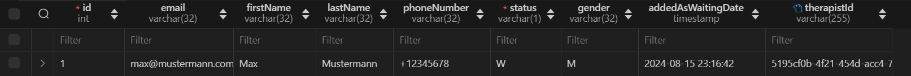

# queue project wiki

---

## Table of Contents

1. [Overview](#overview)
   - [Key Features](#key-features)
2. [Project Structure](#project-structure)
   - [API](#api)
   - [Client](#client)
3. [Database](#database)
4. [Roadmap](#roadmap)
   - [Functionality for Patients](#functionality-for-patients)
   - [Functionality for Therapists](#functionality-for-therapists)

---

## Overview

This application helps therapists efficiently manage the patients which they are treating.

### Key Features

- **Add new patient**: Therapists can easily add new patients by entering their relevant information (e.g., name, contact, condition, etc.)
- **Managing patients**: Therapists can organize and manage patients based on their current treatment status—whether they are in the waiting, active, or inactive states
- **Change of patient state**: Patients can be transferred between different states as their status changes (e.g., from waiting to active)
- **Remove patients**: Therapists can remove patients permanently from their system

---

## Project structure

The project is separated into two main components: API and client, with a MySQL database managed via Docker.

### API

- **Framework**: Built with the NestJS framework
- **Database**: Uses TypeORM for interacting with the MySQL database, which stores patient data and user information
- **Functionality**:
  - Handles authentication using **SuperTokens** for secure session management
  - Performs **CRUD operations** for patient management (add, remove, update patients)
  - Manages **patient state transitions** (waiting, active, inactive) by updating the database
- **Folder structure**:
  - `controllers/`: Contains route handlers for API endpoints
  - `services/`: Houses the business logic, handling database interactions and core functionality
  - `models/`: Defines the data models for patients and users, including relationships and validations

### Client

- **Frontend**: Built with **React** to provide a user interface for therapists
- **Communication**: Uses **Axios** to make HTTP requests to the API for performing CRUD operations and managing patient states
- **Functionality**:
  - Allows therapists to add new patients, remove existing patients, and update patient information
  - Provides a user-friendly interface to manage patient states (waiting, active, inactive)

---

## Database

- **MySQL**: Runs in a Docker container, storing patient records, user data
- **Super Tokens**: stores email and password of users

  - when API is running locally, the Super Tokens Dashboard is accessible with http://localhost:3001/auth/dashboard/

- **Patient database schema**
  

---

## Roadmap

### Functionality for patients

- Patients can log in to the website as well
- A Patient can find Therapists that live near his place
- A map where a patient can see therapists in a defined radius
- Therapists can be filtered by proficiency/ type of therapy
- can apply for patients lists of therapists

### Functionality for therapists

- can add a proficiency/ type of therapy
